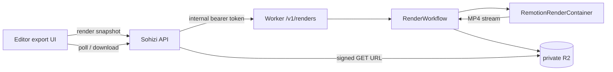

# Sohizi Cloudflare service

One Worker with two jobs:

- `GET /` — MP3 frame-accurate trimming used by captioning (unchanged contract).
- `/v1/renders` — the Remotion export pipeline: a Workflow drives one container
  per render and writes the finished MP4 to a private R2 object.



The editor never talks to this Worker. It posts the snapshot to the Sohizi API,
which owns the `video_render_jobs` row, holds the service token and signs
download URLs.

## Layout

| Path                          | Contents                                                               |
| ----------------------------- | ---------------------------------------------------------------------- |
| `src/index.ts`                | Router: health, render routes, audio trim fallback                     |
| `src/audio/`                  | MP3 frame parsing and the `/` trim handler                             |
| `src/render/`                 | Contracts, auth, R2 keys, media allowlist, Workflow, container binding |
| `container/`                  | Node HTTP service that runs Remotion inside the container              |
| `packages/video-composition/` | Composition shared with the editor preview                             |
| `test/`                       | Vitest suites for the Worker and the container contract                |
| `Dockerfile`                  | Renderer image (built by Wrangler on deploy)                           |

`packages/video-composition` is the single source of truth for the composition.
The editor imports it through a Vite alias, and the Dockerfile copies it into
`node_modules/@sohizi/video-composition`, so preview and export cannot drift.

## Render API

All render routes require `Authorization: Bearer $RENDER_SERVICE_TOKEN`.

| Route                                   | Behaviour                                                                                                                                                                      |
| --------------------------------------- | ------------------------------------------------------------------------------------------------------------------------------------------------------------------------------ |
| `POST /v1/renders`                      | Validates the snapshot, stores it in R2, starts the Workflow with `jobId` as the instance id. Re-posting the same `jobId` returns the existing job instead of a second render. |
| `GET /v1/renders/:jobId?projectId=…`    | Maps the Workflow state to `queued`/`rendering`/`completed`/`failed`/`cancelled`, with progress read from the R2 progress document.                                            |
| `DELETE /v1/renders/:jobId?projectId=…` | Terminates the Workflow and removes the temporary input/progress objects.                                                                                                      |
| `GET /v1/health`                        | Liveness check, unauthenticated.                                                                                                                                               |

R2 layout per job: `renders/<projectId>/<jobId>.input.json` (deleted when the
render ends), `…​.progress.json` (deleted with the input) and `…​.mp4` (kept).

## Configuration

### Worker variables (`wrangler.jsonc`)

| Variable                       | Purpose                                                                                                           |
| ------------------------------ | ----------------------------------------------------------------------------------------------------------------- |
| `MAX_MP3_BYTES`                | Upper bound for the trim route.                                                                                   |
| `RENDER_ALLOWED_MEDIA_HOSTS`   | Comma-separated hosts the container may fetch clip media from. **Required**; an empty value rejects every render. |
| `RENDER_CONCURRENCY`           | Remotion concurrency inside the container.                                                                        |
| `RENDER_POLL_INTERVAL_SECONDS` | Workflow poll cadence.                                                                                            |
| `RENDER_TIMEOUT_MINUTES`       | Hard limit per render, enforced by both the Workflow and the container.                                           |

### Worker secret

```bash
wrangler secret put RENDER_SERVICE_TOKEN --env dev
wrangler secret put RENDER_SERVICE_TOKEN --env prod
```

The same value is passed into the container as `RENDER_TOKEN`, so the container
only accepts requests from this Worker. Generate it with
`openssl rand -base64 32` and rotate by setting the secret, deploying, then
updating the API.

### Sohizi API environment

| Variable                                                                    | Purpose                                               |
| --------------------------------------------------------------------------- | ----------------------------------------------------- |
| `CLOUDFLARE_WORKER_URL`                                                     | Base URL of this Worker.                              |
| `RENDER_SERVICE_TOKEN`                                                      | Must match the Worker secret.                         |
| `RENDER_ALLOWED_MEDIA_HOSTS`                                                | Same allowlist, enforced before the Worker is called. |
| `R2_ENDPOINT`, `R2_ACCESS_KEY_ID`, `R2_SECRET_ACCESS_KEY`, `R2_BUCKET_NAME` | Used to sign the 10-minute download URL.              |

Apply the schema change that stores render jobs with `cd server && bun run db:migrate`.

### R2 access policy

The bucket stays private: outputs are written with
`Cache-Control: private, max-age=0, no-store` and are only reachable through the
API's signed `GET` URL, which forces a `Content-Disposition: attachment`
filename. Do not attach a public `r2.dev` domain to `renders/`.

Downloads are triggered as a top-level navigation, so no bucket CORS rule is
needed. Add one only if a client ever has to `fetch()` an output:

```json
[
  {
    "AllowedOrigins": ["https://app.sohizi.com"],
    "AllowedMethods": ["GET"],
    "AllowedHeaders": ["*"],
    "MaxAgeSeconds": 3600
  }
]
```

Media the container pulls (clip video/audio/images) must be served from a host
in `RENDER_ALLOWED_MEDIA_HOSTS`; that allowlist is what keeps the renderer from
becoming an SSRF proxy.

## Local development

```bash
pnpm install
pnpm --dir packages/video-composition install   # React/Remotion types for the shared package
pnpm cf-typegen        # regenerate worker-configuration.d.ts after binding changes
pnpm typecheck
pnpm test              # Worker + container contract suites
```

The composition package keeps React and Remotion as devDependencies purely so it
type-checks on its own; the editor collapses them onto its copies with
`resolve.dedupe`, and the image resolves them from `/app/node_modules`.

Copy `.dev.vars.example` to `.dev.vars` for local runs. Containers and Workflows
do not run under plain `wrangler dev`; use remote mode, which needs the secret to
exist in the target environment:

```bash
pnpm dev:remote        # wrangler dev --remote
```

Exercise the renderer image on its own before deploying:

```bash
pnpm container:build   # docker build --platform linux/amd64
pnpm container:smoke   # renders a 1s text composition and checks the MP4
```

`container:smoke` starts the image on port 8788, submits a render, polls until
it completes and verifies the downloaded file is non-empty. Override `IMAGE`,
`PORT`, `TOKEN` or `OUTPUT` if the defaults clash.

## Deploy and rollback

```bash
pnpm deploy:dev        # wrangler deploy --env dev
pnpm deploy:prod       # wrangler deploy --env prod
pnpm rollback          # wrangler rollback (Worker code only)
```

Deploying builds and pushes the container image, then rolls it out in the
percentages configured under `containers.rollout_step_percentage`. `rollback`
reverts the Worker script; to revert the renderer, redeploy the previous commit
so the image is rebuilt.

## Limits

| Limit              | Value                                      | Where                           |
| ------------------ | ------------------------------------------ | ------------------------------- |
| Snapshot payload   | 8 MB                                       | `RENDER_LIMITS.maxPayloadBytes` |
| Duration           | 72 000 frames (20 min at 60 fps)           | `RENDER_LIMITS`                 |
| Resolution         | 16–4096 px per side                        | `RENDER_LIMITS`                 |
| Tracks / clips     | 100 / 1 000                                | `RENDER_LIMITS`                 |
| Render wall clock  | `RENDER_TIMEOUT_MINUTES` (30 dev, 45 prod) | Workflow + container            |
| Concurrent renders | `max_instances` (3 dev, 20 prod)           | `wrangler.jsonc`                |
| Container size     | `standard-3`: 2 vCPU, 8 GiB, 16 GB disk    | `wrangler.jsonc`                |

One container serves one job at a time and sleeps after 3 idle minutes.

## Troubleshooting

| Symptom                                   | Cause and fix                                                                                                        |
| ----------------------------------------- | -------------------------------------------------------------------------------------------------------------------- |
| `401 unauthorized` on `/v1/renders`       | API and Worker tokens differ. Re-set the secret, deploy, restart the API.                                            |
| `Clip media host is not allowed`          | The clip URL host is missing from `RENDER_ALLOWED_MEDIA_HOSTS` in both the Worker vars and the API env.              |
| Job sits in `queued`                      | The container is cold or the image is still rolling out. Check `wrangler tail` for `[render-container …] started`.   |
| `render_lost` on a job                    | The Workflow instance aged out of retention. The export has to be resubmitted.                                       |
| Render fails with a `delayRender` message | A clip asset or an HTML clip never loaded. The failure is not retried on purpose; fix the asset.                     |
| `Container is already rendering …`        | Two jobs hit one instance id. Instances are keyed by `jobId`, so this means a duplicate submission with the same id. |
| Output missing after completion           | Check the `store output` step in `wrangler tail`; the MP4 is streamed to R2 there, never buffered in the Worker.     |

Logs: `wrangler tail --env prod`. Container stdout appears in the same stream,
prefixed with `[render]`.
